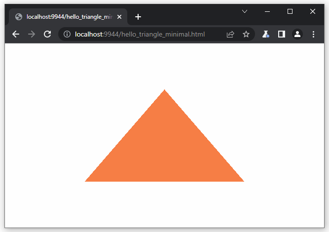
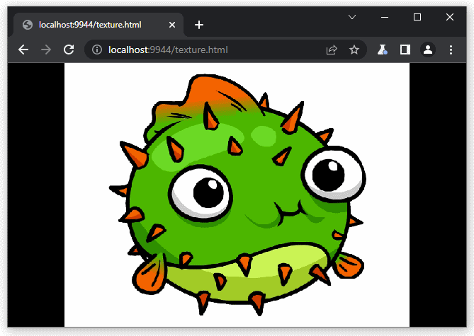

# WebGPU on Wasm via Emscripten

This repository contains an Emscripten system library for utilizing WebGPU from a C/C++ codebase, along with a few small C code examples on how to use it.

To utilize the library in your own application, deploy the following files in the `lib/` directory:

 - [lib/lib_webgpu.h](https://github.com/juj/wasm_webgpu/blob/master/lib/lib_webgpu.h)
 - [lib/lib_webgpu.js](https://github.com/juj/wasm_webgpu/blob/master/lib/lib_webgpu.js)
 - [lib/lib_webgpu.cpp](https://github.com/juj/wasm_webgpu/blob/master/lib/lib_webgpu.cpp)
 - [lib/lib_webgpu_fwd.h](https://github.com/juj/wasm_webgpu/blob/master/lib/lib_webgpu_fwd.h) (optional, not needed if you don't care about using forward declaration headers)

into your project, then `#include "lib_webgpu.h"` in your code to access the API, and compile in `lib_webpgu.cpp` and link with `--js-library /absolute/path/to/lib_webgpu.js` on the Emscripten command line to include the code. See the provided [CMakeLists.txt](https://github.com/juj/wasm_webgpu/blob/master/CMakeLists.txt) for example usage.

## Implementation Status

The repository was last updated to be up to date with the WebGPU specification as of **8/18/2022**.

## Features and Design

This bindings library is developed with the following:

### 1:1 pass-through API mapping

For the most parts, the JavaScript side WebGPU API is directly mapped 1:1 over to WebAssembly side to enable developers to write WebGPU code in C/C++ by using the official [specification IDL](https://www.w3.org/TR/webgpu/) as reference.

Type names and structs follow a naming convention `WGpu*`, mapped from JS names by transforming `GPUAdapter` -> `WGpuAdapter`. API function names use a prefix `wgpu_*`, and are mapped using the convention `GPUCanvasContext.configure(...)` -> `wgpu_canvas_context_configure(canvasContext, ...)`. Enums and #defines use a prefix `WGPU_`, e.g. `GPUPowerPreference` -> `WGPU_POWER_PREFERENCE`.

### Best performance, Minimal code size and JS garbage generation

The primary design goal of the library is to provide absolutely best runtime speed and minimal generated code size overhead, carefully shaving down every individual byte possible. The intent is to enable using this library in extremely code size constrained deployment scenarios.

The library is implemented very C-like, void of high-level JavaScript abstractions, and manually tuned to produce smallest code possible. This has been observed to work best to provide the thinnest JS-Wasm language marshalling layer possible.

Secondary design goal is to minimize the amount of JS temporary garbage that is generated. Unlike WebGL, WebGPU API is unfortunately quite trashy, and it is not possible to operate WebGPU without generated runaway garbage each rendered frame. However, the binding layer itself minimizes the amount of generated garbage as much as possible.

If there is a tradeoff between generated garbage, code size, or runtime speed, build flags are provided to favor one over the other. (currently there aren't any, but this is expected to change)

### Custom API for marshalling buffer data

Some WebGPU features do not interop well between JS and Wasm if translated 1:1. Buffer mapping is one of these features. To help JS<->Wasm interop, this library provides custom functions `wgpu_buffer_read_mapped_range()` and `wgpu_buffer_write_mapped_range()` that do not exist in the official WebGPU specification.

For an example of how this works in practice, see the sample [vertex_buffer/vertex_buffer.c](https://github.com/juj/wasm_webgpu/blob/master/vertex_buffer/vertex_buffer.c)

### Extensions for binding with other JS APIs

To enable easy uploading of image URLs to WebGPU textures, an extension function `wgpu_load_image_bitmap_from_url_async()` is provided. For an example of this, see the sample [texture/texture.c](https://github.com/juj/wasm_webgpu/blob/master/texture/texture.c)

### Asyncify support

When building with Emscripten linker flag `-sASYNCIFY=1`, the following extra functions are available:

- `navigator_gpu_request_adapter_sync` and `navigator_gpu_request_adapter_sync_simple`: Synchronously request a GPUAdapter.
- `wgpu_adapter_request_device_sync` and `wgpu_adapter_request_device_sync_simple`: Synchronously request a GPUDevice.
- `wgpu_buffer_map_sync`: Synchronously map a GPUBuffer.

These functions enable a synchronous variant of the `_async` functions offered in the WebGPU specification. These can be useful for prototyping and test suites etc., though it is not recommended to try to ship a game that uses Asyncify, because it has a very high latency overhead, and breaks ordering and re-entrancy semantics of traditional code execution.

### 2GB + 4GB + Wasm64 support

Currently both 2GB and 4GB build modes are supported. Wasm64 is also planned to be supported as soon as it becomes available in web browsers.

## Samples

Several test cases are available under the `samples/` subdirectory.

Don't expect flashy demos. The test cases exercise features relevant to data marshalling between WebAssembly and JavaScript languages, and are not intended to showcase fancy graphical effects.

To build the samples, first install Emscripten via [Emsdk](https://github.com/emscripten-core/emsdk), then enter Emsdk command line environment (`emsdk_env`), and type

```bash
cd path/to/wasm_webgpu
mkdir build
cd build
emcmake cmake ../samples -DCMAKE_BUILD_TYPE=Debug # Or MinSizeRel, RelWithDebInfo or Release
make -j
```

On Windows, the last `make` command is not available, so either install Mingw32-make via emsdk and run `mingw32-make -j`, or install Ninja via emsdk, then pass `-G Ninja` to the emcmake command line, and then run `ninja` instead of `make`.

### clear_screen


For the smallest Clear Screen "hello world" example, see [clear_screen.c/clear_screen.c](https://github.com/juj/wasm_webgpu/blob/master/samples/clear_screen/clear_screen.c).

There is also an Emscripten ASYNCIFY-enabled variant of the same demo, at [clear_screen.c/clear_screen_sync.c](https://github.com/juj/wasm_webgpu/blob/master/samples/clear_screen/clear_screen.c).

### failing_shader_compilation

The demo [failing_shader_compilation/failing_shader_compilation.c](https://github.com/juj/wasm_webgpu/blob/master/samples/failing_shader_compilation/failing_shader_compilation.c) tests handling of shader compilation errors.

### gpu_oom

The demo [gpu_oom/gpu_oom.c](https://github.com/juj/wasm_webgpu/blob/master/samples/gpu_oom/gpu_oom.c) exhausts the GPU VRAM, testing handling of GPU OOM events.

### hello_triangle



The demo [hello_triangle/hello_triangle_minimal.c](https://github.com/juj/wasm_webgpu/blob/master/samples/hello_triangle/hello_triangle_minimal.c) contains the smallest triangle rendering demo.

The variant [hello_triangle/hello_triangle_verbose.c](https://github.com/juj/wasm_webgpu/blob/master/samples/hello_triangle/hello_triangle_verbose.c) offers the same, but with verbose debug logging.

### texture



The sample [texture/texture.c](https://github.com/juj/wasm_webgpu/blob/master/samples/texture/texture.c) tests the `wgpu_load_image_bitmap_from_url_async()` API.

### vertex_buffer


The test [vertex_buffer/vertex_buffer.c](https://github.com/juj/wasm_webgpu/blob/master/samples/vertex_buffer/vertex_buffer.c) shows an example of how to map a GPU buffer and use the function `wgpu_buffer_write_mapped_range()`.

## TODOs

The following features are planned:
 - Rendering from a Web Worker support
 - Multithreading support when WebGPU spec and browsers enable WebGPU multithreaded rendering
